https://github.com/julyfun/ds-proj2

## baseline

吞吐量、延迟、路线成本使用事件驱动模拟，基本按照题面做的。

```
src
├── base.hpp 基本定义
├── eval.hpp 多版本评估方式
├── event.hpp 事件定义
├── log.cpp 日志 📒
├── log.hpp
├── main.cpp 核心测试点
├── rust.hpp 通用函数 🦀
├── sim.cpp 世界
├── sim.hpp
├── strategy
│   ├── v1.cpp 第一大版本策略图 🎓
│   ├── v1.hpp
│   ├── v2.cpp 第二大版本策略图
│   ├── v2.hpp
│   ├── v3.cpp 第三大版本策略图
│   └── v3.hpp
├── strategy.cpp 策略通用函数
└── strategy.hpp

data
└── data_gen.py 生成模拟数据

UI
├── README.md 如何使用可视化 👁
└── UI.py 可视化

third_party
├── doctest 单元测试
└── fmt 格式化日志
```

## 系统评估设计

我们有多个版本的运输策略和评估策略。我们比较满意评估函数的是 `V1`：

```
运输成本
+ 快包裹运输时间 * 1，若超过 24h，立即增加 50，每小时增加 3
+ 慢包裹运输时间 * 1，若超过 72h，立即增加 50，每小时增加 3
```

这是认为包裹有一个承诺期限，如果承诺期限没有送到，快递公司就要交违约金。

## 运行方法

```
git clone git@github.com:julyfun/ds-proj2.git
cd ds-proj2
git submodule update --init # 获取 fmt 库
mkdir build
cd build
cmake ..
make -j8
```

编译完成，接下来，我们有若干测试点，你可以选择一个测试。

```
# 测试简单路径（见 main.cpp 中的 `TEST_CASE("simple")`）
./run --dt-test-case=simple -s`
# 测试 dijkstra 算法是否正确
./run --dt-test-case="dijkstra*" -s`
# 生成较大测试数据
cd ../data
python3 data_gen.py
cd ../build
# 测试该数据下的所有算法性能
./run --dt-test-case="main-pk" -s 1>/dev/null
./run --dt-test-case="smart-pk" -s 1>/dev/null
```

输出形如：

```
Eval V0 ====================
    Run 1428.923541ms spent for simulation # 评估函数版本 V0，决策版本 V1 的运行时间
     V1 cost: 136014.03769810183 events: 84794 # 评估总代价以及事件数量
    Run 1395.185709ms spent for simulation # 评估函数版本 V0，决策版本 V1B 的运行时间..
    V1B cost: 133819.6372244197 events: 85308
    Run 420.290625ms spent for simulation
     V2 cost: 134286.83741917566 events: 15107
    Run 418.573625ms spent for simulation
    V2B cost: 116403.34815027067 events: 15092
    Run 438.005ms spent for simulation
     V3 cost: 125184.70475334405 events: 15187
Eval V1 ====================
    Run 1263.151417ms spent for simulation
     V1 cost: 272445.42059001856 events: 84794
    Run 1324.025458ms spent for simulation
    V1B cost: 268297.8841774791 events: 85308
    Run 422.177125ms spent for simulation
     V2 cost: 269655.11557886034 events: 15107
    Run 418.104ms spent for simulation
    V2B cost: 275809.0009622771 events: 15092
    Run 434.665792ms spent for simulation
     V3 cost: 294798.43371186795 events: 15187
```

### `TEST_CASE("smart")` 生成的高压数据下

| Eval | V1       | V1B      | V2       | V2B     | V3      |
| ---- | -------- | -------- | -------- | ------- | ------- |
| V0   | 12987.60 | 12987.60 | 6738.70  | 4338.70 | 4338.70 |
| V1   | 18135.15 | 18135.15 | 10636.80 | 8436.80 | 8436.80 |

然而不同组采用的估价函数和模拟方法都不一样，只能自己和自己比较咯~

### `data_gen.py` 生成的低压力数据优化效果

| Eval | V1        | V1B       | V2        | V2B       | V3        |
| ---- | --------- | --------- | --------- | --------- | --------- |
| V0   | 136014.04 | 133819.64 | 134286.84 | 116403.35 | 125184.70 |
| V1   | 272445.42 | 268297.88 | 269655.12 | 275809.00 | 294798.43 |

没啥进步，这 V3 怎么还变笨了。

## Roadmap

https://docs.qq.com/sheet/DWHJOZHRLZE9YaUpt?tab=BB08J2

## 学习资料

- 事件驱动编程: https://stdcxx.apache.org/doc/stdlibug/11-3.html

## 策略设计

### V1



问题:

- 同一个站点的 TryProcess 可能会平方增长，log 爆炸

### V1.a (deprecated)

记录全局 floyd，且记录是否预定了 TryProcessOne。

- 静态

### V1.b

`dijkstra enhanced` 当有站点 buffer 比较满的时候，不选择该站点。若生成路径失败，则采用原始 `dijkstra`

ref: https://www.mdpi.com/2071-1050/14/16/10367

- 动态

### V2

- 记录 package 的去向，在 dijkstra 中估计等待时间，加入代价估计中。可设定线性参数来估计未来代价，假定到达时间之前站点疯狂处理包裹
- 优化站点 Try 失败后添加 Try 的策略，添加 ok 锁，减少事件数量

### V2.b

- 优先取 EXPRESS

问题：

- 跑的太慢, 1152 行数据跑了 2~3s（开 O2 以后 600ms ~ 900ms）
- 会有死包裹

### V3

- 同样利用 v2 的 cache 计算最短路，但同时计算“假设立即发送此包裹，则送达时间距离 DDL 还有多久”，站点负责发送离 DDL 最近的包裹。
- 避免了优先 STANDARD 死包裹

### V4

定时采样，用滤波器记录历史站点的拥堵情况，判断拥堵的可能性。

## 评估函数

### V0

```
运输成本 + 快包裹运输时间 * 3 + 慢包裹运输时间 * 1
```

问题：不能防止死包裹

### V1

```
运输成本
快包裹运输时间 * 1，若超过 24h，立即增加 50，每小时增加 3
慢包裹运输时间 * 1，若超过 72h，立即增加 50，每小时增加 3
```
